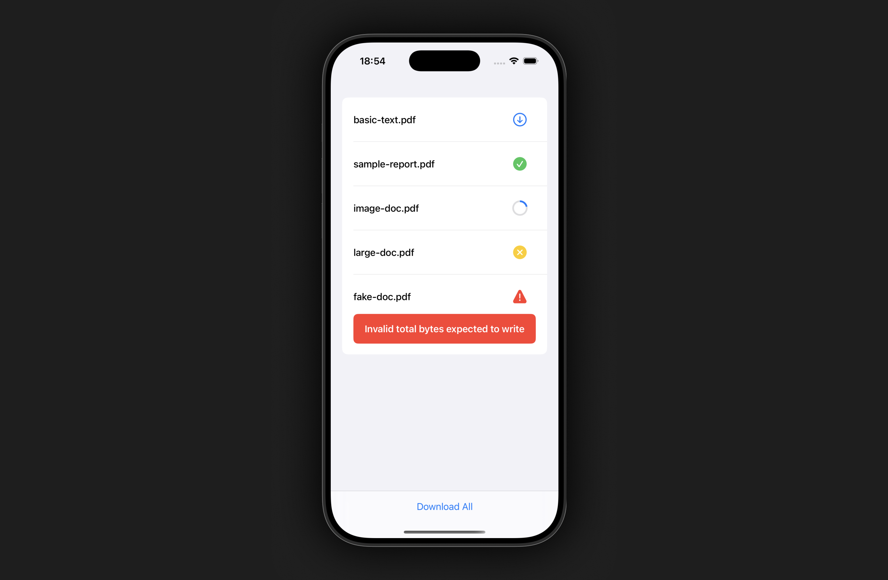

## Exploring Swift Concurrency: DownloadManager

This project is an exercise in learning to make use of **Swift Concurrency** features to solve **race condition problems**. Since Swift's `actor` serializes all access (reading and writing), half-updated or conflicting data will never be served.

**DownloadManager** was designed as an `actor` to safely manage multiple file downloads in parallel. It allows for download cancelation and real-time progress tracking, and safely handles duplicate download attempts. Use cases range from a browser-like download screen to a media app that downloads content on demand.

### Implementation

- Protocol-Oriented Design
- Test-Driven Development
- Swift Strict Concurrency (Complete)
- Progress Updates via `AsyncStream`
- SwiftUI Sample Project
- PDFViewer in SwiftUI via `PDFKit`

### Sample Project

I've written and attached a single-screen `/SampleProject` that implements a concurrent user downloads list using the DownloadManager. The user can start, track progress, cancel, delete and restart a download, can also view each PDF file in the app with the `PDFKit` implementation included.

